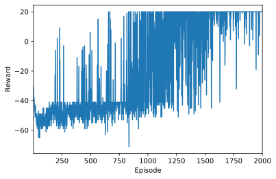
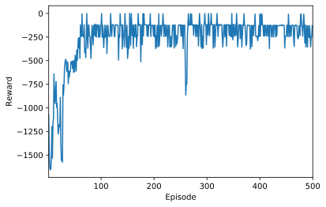

**CEOT-DRL** is a deep reinforcement learning (DRL) package mainly used in the Centro de Electrónica, Optoelectronica e Telecomunicações (CEOT) research center: https://www.ceot.ualg.pt/ for DRL research on networking and systems. **CEOT-DRL** is designed such that it abstracts almost everything. Therefore, regardless of which computational graph platform is used to define the neural nets, it still can run smoothly. 

Published version of **CEOT-DRL** 0.1 supports only common DRL algorithms, but our own models/algorithms will be published here after the papers gets published. Currently supported algorithms:

## Implemented algorithms: 
 #### 1- DQN (included): https://arxiv.org/abs/1312.5602
 #### 2- Double DQN (included) : https://arxiv.org/abs/1509.06461
 #### 3- Deuling Double DQN (included) : https://arxiv.org/abs/1511.06581
 #### 4- Actor-Critic (A2C) with n-steps (included) : https://arxiv.org/abs/1602.01783
 #### 5- Deep Deterministic Policy Gradient (DDPG) (included) : https://arxiv.org/abs/1509.02971
 #### 6 - DQN with Prioritized Experience Replay (in progress)
 #### 7 - DQN with LSTM (queued)
 #### 8 - TD3 (queued)

Current examples of **CEOT-DRL** are implemented in **pytorch** but it should support any platform. The reason is that, the agents are implemented in a computational graph lib-agnostic way.

## **CEOT-DRL** is composed of these main parts:
 
 #### 1- Scenarios:
 A scenario file is used to define all parameters for the core and environment class. As well as the training options.
 It represents the problem, we want to solve, we feed it to a training manager, which run it and produce the results.
 
 #### 2- Core classes: 
  These are used to create replay memory, neural networks, agent algorithms, .... and so on. They are all abstract so that they can be reshaped according to the required scenario.
  Each agent has a neural net wrapper/architecture, which implements the neural net components separately. For example, the `DDPGAgent` class has a neural network wrapper `neural_net_wrapper:DDPGDNN` in the `DNN.py` file, which handles the neural network stuff independently from the `DDPGAgent` class

 #### 3 - Environment class:
 This class is abstract as well, and can be reshaped to fit any environment. In addition, to user-defined environments classes from openAI `gym` can be used. See scenario folder for example.

 #### 4 - Training Manager class:
 This class takes care of the training task, where it handles the training of the agents.

 #### 5- run file:
 This file main role is to read the scenario file and send it to the training manager to run it.
 

## Using CEOT-DRL package to solve problems with different agents
The following examples shown how to create and use scenarios to solve problems using **CEOT-DRL**.

Each example has a scenario and uses the training manager `TrainingManager` to execute the scenario. For a scenario example see `scenario.py`. To create your own scenario, you need to:
    * subclass the abstract environment class `AbstractEnvironment`,
    * create neural networks architecture (see `DDN.py` file for different architectures in **Pytorch**), using any platform you like (torch, TF, Keras, and so on), 
    * and then use ( or create) an agent training algorithm (DQN, AC, ...).

### Example 1: Using Deuling DQN to solve an empty slot problem. 

In empty slot problem, the state is a vector of n elements (slots). Each element
can be either 1 or 0. A slot is said to be empty if its value is 0 and occuped
if it is 1. The agent will try to place 1s in the empty slots. If it places 1 in
a slot that is already contains 1, then it recieves a negative rewarad, and
positive rewarad otherwise.

    import sys
    sys.path.append("..")
    
    from MLS.ceot_drl.scenarios import scenario as s
    from MLS.ceot_drl.core.TrainingManager import TrainingManager as TM
    
    import timeit
    
     
    
    def main():
        # define a training manager object
        tm = TM(s.num_episodes, 
                s.episode_length, 
                s.agent,
                s.env,
                log_file=s.log_file)
    
        print('Scenario:%s' % s.title)
        start = timeit.default_timer()
        # let it do the magic
        tm.run(verbose=False)
        end = timeit.default_timer()
        print('\n It took ~{} useconds'.format(str(round(end-start))))
        
    
    
    if __name__ == "__main__":
        # execute only if run as a script
       main()
    

    Scenario: Solving empty slot problem using DQN
    

    
     It took ~477 useconds

It is also possible to use another flavors of DQN algorithm, like Double DQN or Deuling DQN.
 > Please note that since DQN, Double DQN, and Deuling DQN differ only in the neural network architectures, we use a singel class `DQNAgent` with the same Q-learning training algorithm and feed it with different DNN architectures and other hyperparamaters regarding the DQN flavor

### Example 2: Using AC agent to solve the carte-pole problem.

    import sys
    sys.path.append("..")
    
    from MLS.ceot_drl.scenarios import scenario_ac as s
    from MLS.ceot_drl.core.TrainingManager import TrainingManager as TM
    
    import timeit
    
     
    
    def main():
        # define a training manager object
        tm = TM(s.num_episodes, 
                s.episode_length, 
                s.agent,
                s.env,
                log_file=s.log_file)
    
        print('Scenario:%s' % s.title)
        start = timeit.default_timer()
        # let it do the magic
        tm.run(verbose=False)
        end = timeit.default_timer()
        print('\n It took ~{} useconds'.format(str(round(end-start))))
        
    
    
    if __name__ == "__main__":
        # execute only if run as a script
       main()
    

    Scenario: CartePole-v1 using A2C n-step algorithm

    
     It took ~280 useconds

### Example 3: Using DDPG agent to solve the Pendulum-v0 problem

    import sys
    sys.path.append("..")
    
    from MLS.ceot_drl.scenarios import scenario_ddpg as s
    from MLS.ceot_drl.core.TrainingManager import TrainingManager as TM
    
    import timeit
    
     
    
    def main():
        # define a training manager object
        tm = TM(s.num_episodes, 
                s.episode_length, 
                s.agent,
                s.env,
                log_file=s.log_file)
    
        print('Scenario:%s' % s.title)
        start = timeit.default_timer()
        # let it do the magic
        tm.run(verbose=False)
        end = timeit.default_timer()
        print('\n It took ~{} useconds'.format(str(round(end-start))))
        
    
    
    if __name__ == "__main__":
        # execute only if run as a script
       main()
    

    Scenario: Solving Pendulum-v0 problem using DDPG algorithm

    
     It took ~503 useconds

 
 

